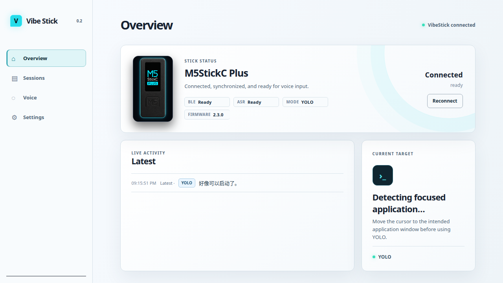

# Vibe Stick

**Vibe Stick** turns an M5Stick into a small, tactile companion for AI coding
agents. It connects over Bluetooth Low Energy (BLE), surfaces the active
session on the device, and lets you navigate targets, control a session and
send voice input without leaving your keyboard.

The project consists of a native desktop application and open firmware for
supported M5Stick boards. The current release line is **0.2.x** for both.

> Vibe Stick is an independent community project. It is not affiliated with
> Anthropic, OpenAI, M5Stack, or any supported CLI project.

## Highlights

- Native **Vibe Stick** desktop app built with Tauri and React — install it from
  your application menu, with a tray indicator for the Stick connection.
- BLE device status, current target and recent activity in one overview.
- Integration-oriented session discovery for Claude Code, Codex, OpenCode and
  Kimi CLI.
- On-device controls, display, microphone capture and local/online speech
  recognition routing.
- Firmware for **M5StickC Plus** and **M5StickS3**.
- Local-first operation: the desktop dashboard is served on loopback only;
  diagnostics deliberately redact paths, commands, transcripts and audio.

## Desktop app

The desktop app brings connection state, speech recognition, recent activity
and the active delivery target into one native window. It supports English,
Simplified Chinese, system/light/dark appearance settings, reconnect controls
and a live system-tray connection indicator.



## Hardware support

| Board | PlatformIO environment | Release firmware |
| --- | --- | --- |
| M5StickC Plus | `m5stick-c` | `vibestick-m5stick-c-0.2.1.bin` |
| M5StickS3 | `m5stick-s3` | `vibestick-m5stick-s3-0.2.1.bin` |

The firmware advertises as **VibeStick**. That is the BLE device name; the
project is named **Vibe Stick**.

## Get started on Linux

### 1. Install the desktop app

Download the matching `.deb` from a release, then install it.

```sh
sudo apt install "./Vibe Stick_0.2.1_amd64.deb"
```

Launch **Vibe Stick** from your application menu. The app starts its local host
runtime, provides a connection indicator in the system tray, and opens the
Overview screen. It does not need a browser or a development server.

### 2. Flash the firmware

With the Stick attached by USB, build and upload the firmware for your board:

```sh
# M5StickC Plus
firmware/.venv/bin/pio run -d firmware -e m5stick-c -t upload

# M5StickS3
firmware/.venv/bin/pio run -d firmware -e m5stick-s3 -t upload
```

If your serial device is not detected automatically, add `--upload-port
/dev/ttyUSB0` (or the appropriate device path).

### 3. Pair and connect

1. Turn on the Stick; it advertises as `VibeStick`.
2. Pair it in your operating system's Bluetooth settings.
3. Open Vibe Stick and use **Reconnect** from Overview or Device setup if it
   does not connect automatically.

When the header indicator is green and Overview reports **BLE Ready**, the
device is connected. The local diagnostics endpoint is available at
`http://127.0.0.1:7861/api/diagnostics` for troubleshooting.

## How it works

```text
M5Stick firmware  ←──── BLE GATT ────→  Vibe Stick HostCore  ←→  Agent CLI sessions
   display, keys, mic                       desktop app              Claude Code
                                                                       Codex
                                                                       OpenCode
                                                                       Kimi CLI
```

The TypeScript HostCore owns session state, routing and BLE synchronization.
On Linux it uses a small BlueZ/PipeWire compatibility helper for the platform
capabilities that require those system APIs; this is a backend component, not
a second Vibe Stick GUI or daemon that users need to launch separately.

## Repository layout

- [`firmware/`](firmware/) — PlatformIO firmware for both supported boards.
- [`host-ts/`](host-ts/) — TypeScript HostCore, BLE protocol implementation,
  tests and desktop app.
- [`host-ts/desktop/`](host-ts/desktop/) — Tauri desktop application.
- [`contracts/v1/`](contracts/v1/) — versioned cross-runtime contract
  fixtures.
- [`docs/protocol.md`](docs/protocol.md) — BLE GATT protocol reference.
- [`release/0.2.1/`](release/0.2.1/) — locally built release artifacts.

## Development

Prerequisites: Node.js 24+, Rust, PlatformIO, and the Linux desktop build
dependencies required by Tauri/WebKitGTK.

```sh
# HostCore checks
cd host-ts
npm install
npm test

# Desktop app in development mode
cd desktop
npm install
npm run dev

# Production desktop package
npm run package

# Firmware builds
cd ../../firmware
.venv/bin/pio run -e m5stick-c
.venv/bin/pio run -e m5stick-s3
```

`npm run dev` is only for contributors. It starts Vite on port 5174 while
developing; released Vibe Stick packages do not depend on that server.

## Troubleshooting

- Use the **Reconnect** action in Vibe Stick before re-pairing the device.
- If pairing is stale, remove `VibeStick` in the OS Bluetooth settings, pair
  it again, then reopen Vibe Stick.
- For firmware logs: `firmware/.venv/bin/pio device monitor --port
  /dev/ttyUSB0 --baud 115200`.
- For host diagnostics: `curl -s http://127.0.0.1:7861/api/diagnostics`.

Please remove API keys, transcripts, machine paths and device identifiers
before posting logs in an issue.

## Contributing

Issues and pull requests are welcome. Please keep protocol changes compatible
with [`docs/protocol.md`](docs/protocol.md), include tests for HostCore changes,
and build both firmware targets when modifying shared firmware code.

## License

A license file has not yet been added to this repository. Before redistributing
Vibe Stick as an open-source project, the maintainers need to choose and add an
explicit license; until then, normal copyright restrictions apply.
